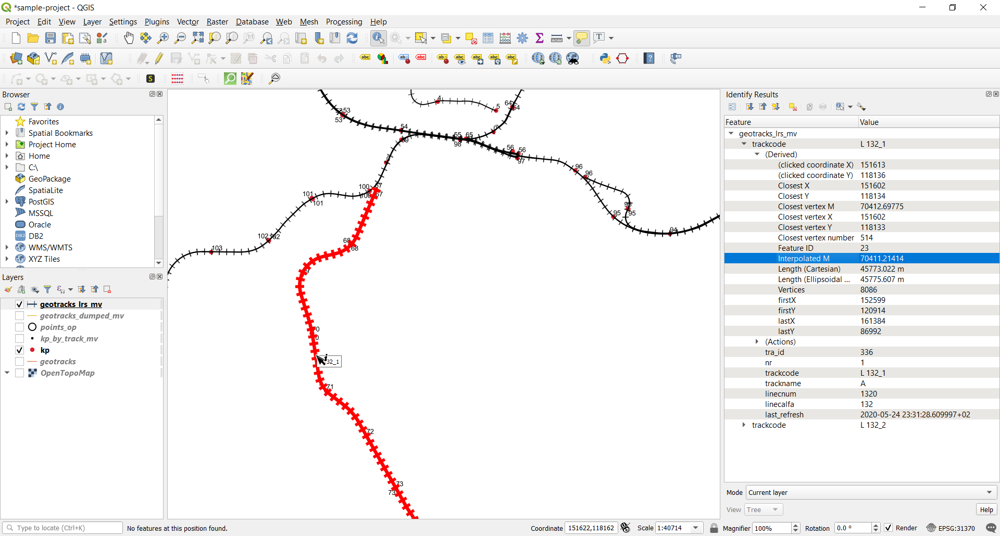

# infrabel-opendata-to-pg
This tool allows to:

* Copy tables from Infrabel open data portal to PostgreSQL/PostGIS.
* Generate a Linear Referencing System from the geometry of the tracks and the positions of kilometer poles.
* Click on a map to show the kilometer pole and distance on the nearesr track. Demo here: https://railbe-lrs.kediss.eu/

The website is really simple and does not use any framework besides Leaflet and jQuery. The backend consists of two PHP files.

## Tools
You need to install the following tools:

* PostgreSQL
* PostGIS
* ogr2ogr (from GDAL)
* wget

Tested on a VM running on Debian 10 Buster, with PostgreSQL 12, PostGIS 3 and GDAL 2.4. 

Note: Debian Buster comes with PostgreSQL 11. Use the [pgdg repo](https://wiki.postgresql.org/wiki/Apt) to get the latest PostgreSQL version for Debian (12 at the moment).

## Setup database
Install [PostgreSQL](https://postgresql.org) and [PostGIS](https://postgis.net) for your operating system.

Check if PostgreSQL is correctly installed:

```bash
~$ sudo -u postgres psql -A -c 'SELECT version();'
version
PostgreSQL 12.3 (Debian 12.3-1.pgdg100+1) on x86_64-pc-linux-gnu, compiled by gcc (Debian 8.3.0-6) 8.3.0, 64-bit
(1 row)
```

## Create a new database and enable PostGIS

With the user `postgres`, create a new user `pguser` (or another name) and make it owner of a new `opendata` database:

```sql
CREATE DATABASE opendata OWNER pguser;
```

Install PostGIS in a separate schema:

```sql
CREATE SCHEMA postgis;
ALTER SCHEMA postgis OWNER TO pguser;
CREATE EXTENSION IF NOT EXISTS postgis WITH SCHEMA postgis;
ALTER DATABASE opendata SET search_path TO 'public', 'postgis', '$user';
```

Check if PostGIS is correctly installed:
```bash
~$ psql -U pguser opendata -A -c 'SELECT postgis_full_version();'
postgis_full_version
POSTGIS="3.0.1 ec2a9aa" [EXTENSION] PGSQL="120" GEOS="3.7.1-CAPI-1.11.1 27a5e771" PROJ="Rel. 5.2.0, September 15th, 2018" LIBXML="2.9.4" LIBJSON="0.12.1" LIBPROTOBUF="1.3.1" WAGYU="0.4.3 (Internal)"
(1 row)
```

Connect as `pguser` and create a new `infrabel` schema:
```sql
CREATE SCHEMA infrabel AUTHORIZATION pguser;
```

Run `create_tables.sql` script inside `psql`:
```
psql -U pguser opendata -f create_tables.sql
```

Run script
```
./import-infrabel-opendata.sh
```

## Sample queries

```sql
-- Find the Kilometer Pole on the nearest track (with a max distance of 100m)
-- from a known position (4.391906, 50.373239)
-- and also return the coordinates of the projected point on the track axis
WITH pt_l72 (geom) AS
(
  -- as our track's geometries are in Lambert 72 coordinates, we first need
  -- to convert the GPS coordinates from WGS84 (EPSG:4326) to Lambert 72 (EPSG:31370)
  VALUES (ST_Transform(ST_SetSRID(ST_MakePoint(4.391906, 50.373239), 4326), 31370))
)
SELECT
  g.trackcode,
  ROUND(ST_InterpolatePoint(g.geom, p.geom)) AS measure,
  ST_AsText(ST_Transform(ST_ClosestPoint(g.geom, p.geom), 4326)) AS point_on_line
FROM
  infrabel.geotracks_lrs_mv AS g
JOIN
  pt_l72 AS p ON ST_DWithin(g.geom, p.geom, 100.0)
ORDER BY
  ST_Distance(g.geom, p.geom)
LIMIT
  1;
```

```
trackcode|measure|point_on_line                           |
---------|-------|----------------------------------------|
L 132_1  |70517.0|POINT(4.39149050813109 50.3731977921141)|
```

```sql
-- Find the GPS coordinates of Kilometer Pole (70.517) on a given track (L 132_1)
SELECT
  g.trackcode,
  ST_AsText(ST_Transform(ST_LocateAlong(g.geom, 70517), 4326)) AS geom
FROM
  infrabel.geotracks_lrs_mv AS g
WHERE
  g.trackcode = 'L 132_1';
```

```
trackcode|geom                                            |
---------|------------------------------------------------|
L 132_1  |MULTIPOINT ((4.39149071186285 50.3731969520237))|
```

## Example in QGIS



## Webmap with geolocation

This is a demo map using. It was made using old-school javascript. No framework, no webpack. Just Leaflet and good old JQuery.

https://railbe-lrs.kediss.eu/

